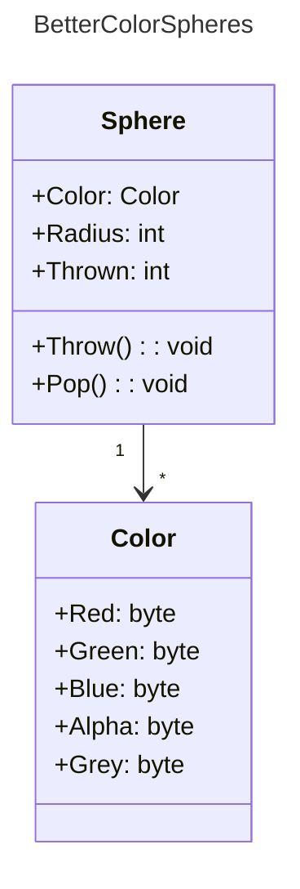

```mermaid
---
title: BetterColorSpheres
---
    classDiagram
    Sphere "1" --> "*" Color
    class Sphere{
    +Color: Color
    +Radius: int
    +Thrown: int
    +Throw(): void
    +Pop(): void
    }

    class Color{
      +Red: byte
      +Green: byte
      +Blue: byte
      +Alpha: byte
      +Grey: byte
      }
```